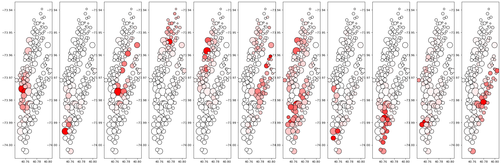

# Concept
We develop python code for a stochastic block model that takes detects time connectivity curves. It can detect work and home commute but it can also detect many different interesting patterns:
For example here is Los Angeles with 10 blocks. 

with broad commute patterns 
.

Here is an example from Manhattan

# Description: 
* This folder holds extra exploratory analysis for the paper  https://arxiv.org/abs/1908.09440
* Official supplementary code and data for paper can be found https://github.com/jcarlen/tdsbm_supplementary_material

# Extended exploration of time-dependent stochastic block models
Will contain mostly python code and will contain extended results as well as methods.
The following methods will be considered:
* Python implementation of discrete (sparse role) stochastic block model
* Python implementation of Matias-Rebafka model - with discretized time bins so it is fully parametric- not semi-parametric.

* Bagging days/ individual days to decrease variance in the block inference
* Higher number of blocks 5-10 blocks
* Hierarchical blocks: FOr the discrete model, we will extract block networks when they form communities.
    * For continuous models we will probabilistically extract block networks by defining probability distributions on trips and then extracting blocks. 
